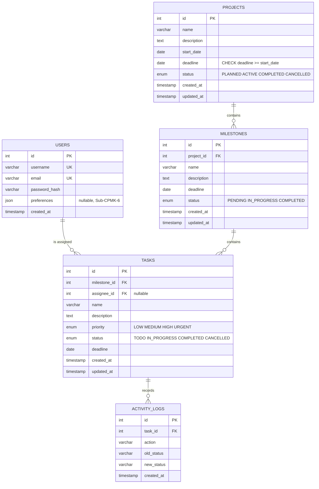

# Entity Relationship Diagram

The diagram matches `src/bismillah_mbd/sql/schema.sql` exactly.

Relationships implemented by foreign keys:

| Relationship | FK column | On delete |
|---|---|---|
| projects 1:N milestones | milestones.project_id | CASCADE |
| milestones 1:N tasks | tasks.milestone_id | CASCADE |
| users 1:N tasks (assignment) | tasks.assignee_id (nullable) | SET NULL |
| tasks 1:N activity_logs | activity_logs.task_id | CASCADE |

`tasks.assignee_id` is nullable: deleting a user does not delete their tasks,
the assignment becomes NULL.

