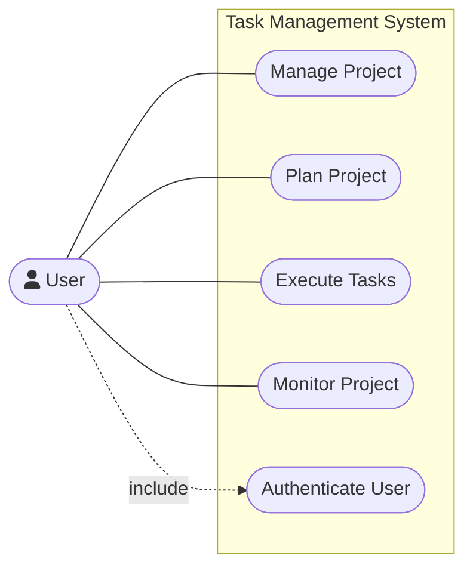

# Use Case Diagram

Actor: **User**

Main business use cases (exactly four):

1. Manage Project
2. Plan Project
3. Execute Tasks
4. Monitor Project

Supporting use case (not counted as a main business use case):

- Authenticate User

Notes:

- CRUD operations (create/update/delete project, etc.) are **not** modeled as separate
  top-level use cases; they are the internal steps of the four main use cases.
- `Authenticate User` is drawn with an `include` relationship because every other
  use case assumes an identified user, but it remains a supporting use case.
